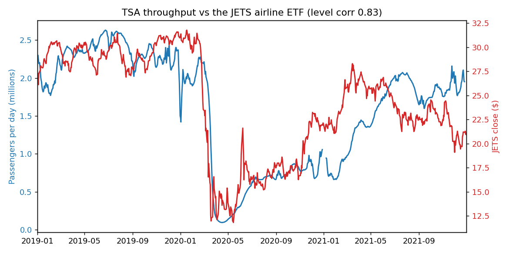
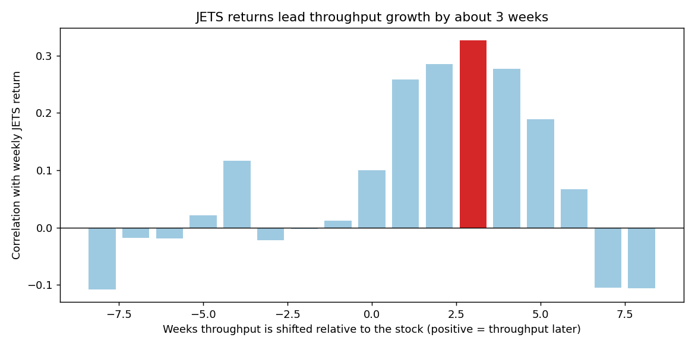
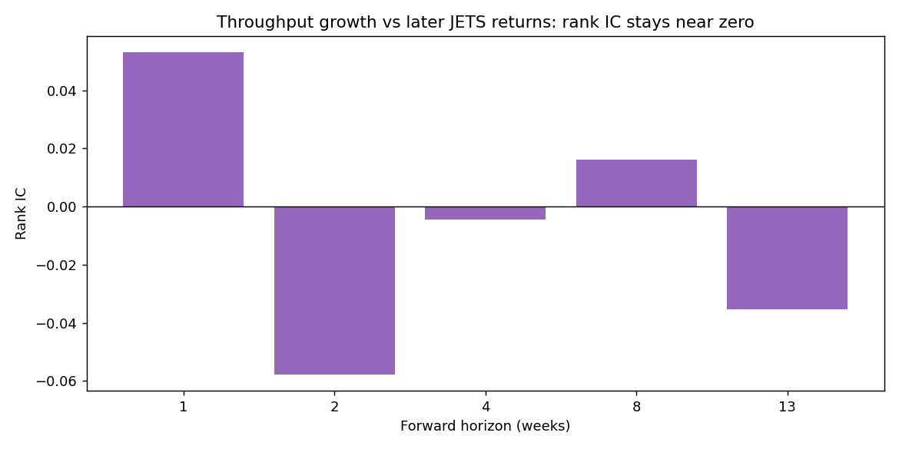

# alternative-data

A set of collectors for free, public datasets, each turned into a factor and lined up against stock returns. The one I cared about: TSA publishes how many people it screened at airport checkpoints every day, for free, the next morning, and airlines live or die on passenger demand. So can you read the recovery in the throughput numbers before it shows up in the stock?

The idea came from [Katona, Painter, Patatoukas and Zeng, "On the Capital Market Consequences of Big Data: Evidence from Outer Space"](https://papers.ssrn.com/sol3/papers.cfm?abstract_id=3222741), who count cars in retailer parking lots from satellite images and trade the retailer ahead of its earnings. TSA checkpoint counts are the same shape of data: a physical activity count that should track a sector's revenue, sitting in public for anyone to read. The repo also pulls OpenTable diners, building permits, earthquakes, grid carbon intensity, box office, web traffic and rents, but airlines are where I took it furthest.

## The data

I pulled daily TSA throughput back to 2019 and the JETS airline ETF over the same window.

The levels track at a correlation of 0.83. That chart is what got me interested, and it is also a trap.

## Timing

Cross correlate weekly throughput growth against JETS returns at a range of leads and lags, and the peak is not at zero.

JETS returns line up best with throughput growth about three weeks later, so the stock moves first. By late 2020 JETS had doubled off the bottom on vaccine headlines while checkpoints were still near empty, and through 2021 throughput kept rising after the stock had already peaked.

## Does it predict returns

Not in the direction you would want. Rank the weeks by throughput growth, look at the next few weeks of JETS returns, and the rank IC wanders around zero.

The count is real and it does track the business. It just arrives after the market has priced it, which is the same thing the satellite paper found: once the alternative data confirms what is happening on the ground, the edge is already gone.

## Running it

`scripts/throughput_vs_airlines.py` pulls both series and regenerates the three figures above. The collectors and factor code are under `src/`.
